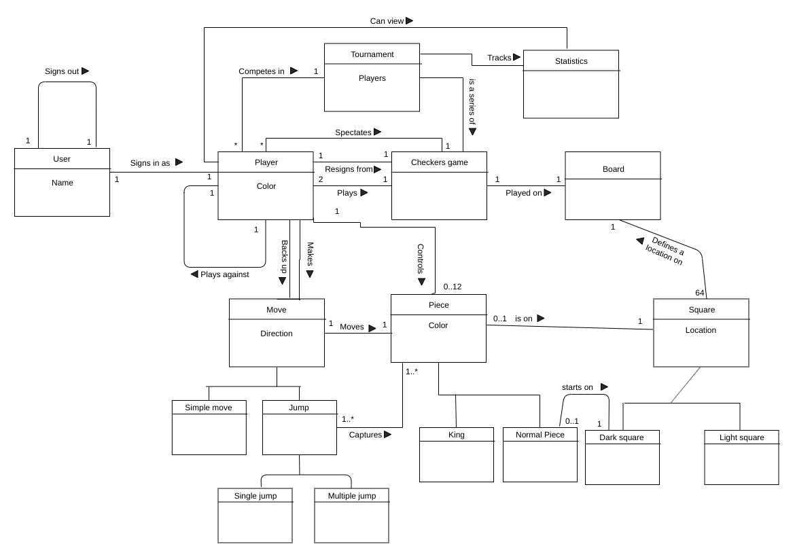
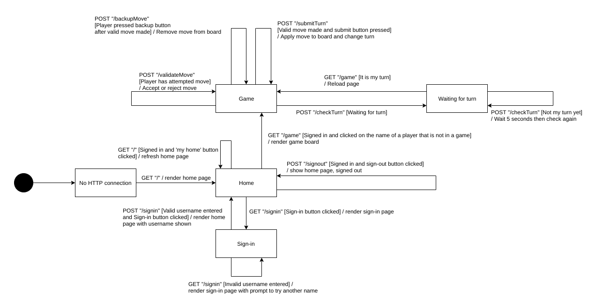
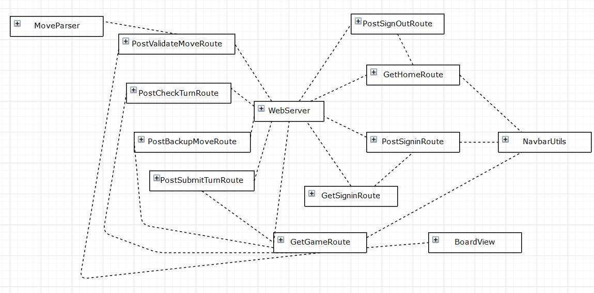
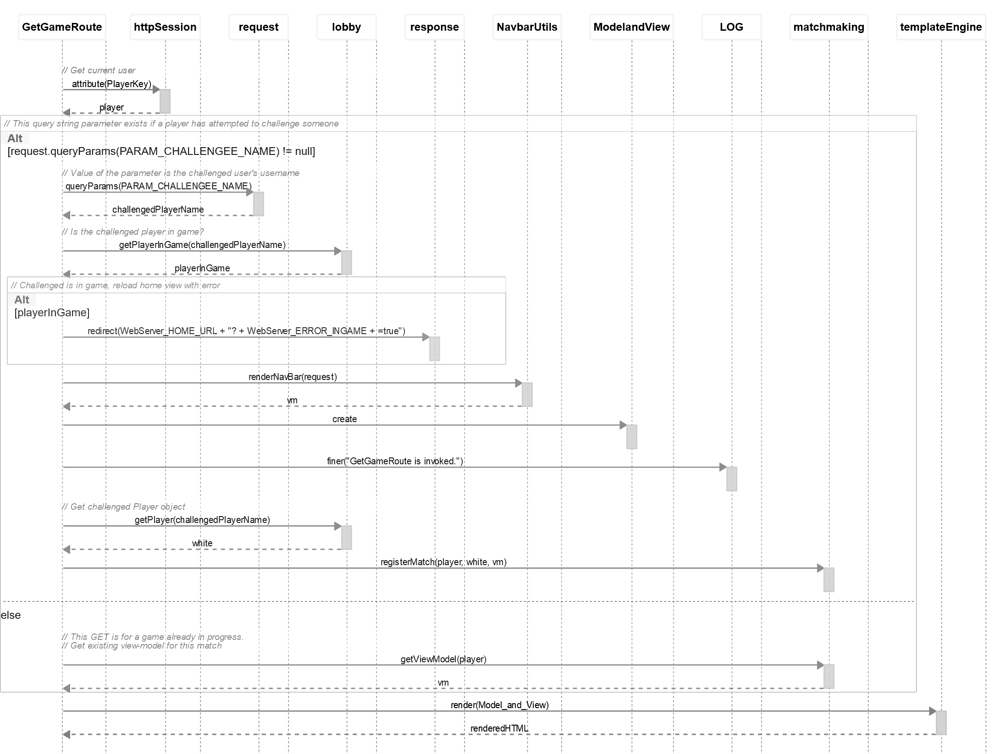
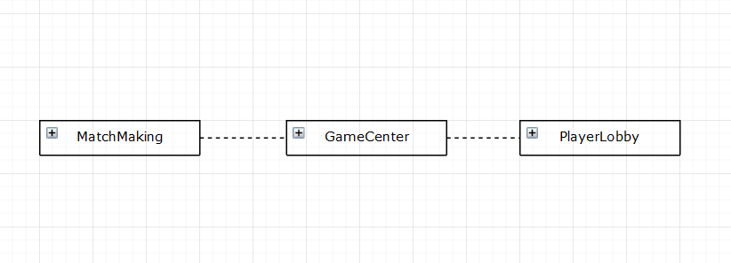
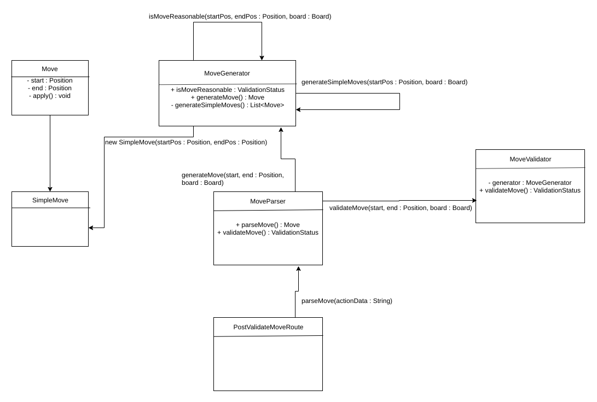
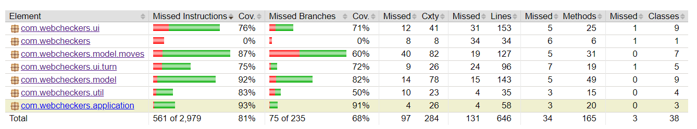

# PROJECT Design Documentation

## Team Information
* Team name: C
* Team members
  * Stuart Nevans Locke
  * Eric Chen
  * Shane Burke

## Executive Summary

This project, WebCheckers, is a program that implements an application that allows users to sign
into a webapp and play checkers online against each other. The game follows the
American rules of checkers and uses a game user interface (UI) that uses drag-and-drop
browser capabilities for making moves. This project also allows users to sign out and
resign from the game.

### Purpose
The purpose of this project is to create WebCheckers program using SCRUM method planning, 
and agile project management that includes the usage of incremental Sprints and 
regular meetings and communication between team members. 

### Glossary and Acronyms
| Term | Definition |
|------|------------|
| VO | Value Object |
| MVP | Minimum Viable Product |

## Requirements

This section describes the features of the application.

### Definition of MVP
The Minimum Viable Product is a web game of checkers that is based upon 
the American Rules of Checkers. Every player must sign-in to the web
checkers app before playing the game and be able to sign-out when
finished playing. Also, players can resign from a game they're playing
at any point to end the game.

### MVP Features

Epic: Game Setup: As a Player, I want to be able to start the game so that I can play a game of checkers.

Player Sign-In: _As a Player I want to sign-in so that I can play a game of checkers._

Start a Game: _As a Player I want to start a game so that I can play checkers with an opponent._

Player Sign-Out: _As a Player I want to sign out of the server so that I can finish playing without forcefully exiting the application._

Epic: Player Movement: As a Player I want to move my piece so that I can play against my opponent.

Simple Moves: _As a Player I want to be able to make simple moves only so that I can follow the rules when making my turn._

Jump Moves: _As a Player I want to make jump moves so that I can capture the opponent's pieces._

### Roadmap of Enhancements

Epic: Game Spectating: As a Player I want to spectate other players' games so that I can view games in progress.

Seeing Changes when Spectating: _As a Player I want to see changes in the board of the game I am spectating so that I can watch the gameplay as it happens._

Epic: Tournament Enhancement: As a player I want to enter a tournament so that I can play a longer, more competitive series of games with multiple payers.

Tournament Matchmaking: _As a Tournament Participant I want to be entered into games with other tournament participants so that I can advance through the tournament ladder._

Viewing Tournament Statistics: _As a Tournament Participant I want to view tournament statistics so that I can compare my performance to that of other tournament participants._

## Application Domain

This section describes the application domain.

The domain includes the gameplay elements of WebCheckers as defined by the standard rules of the game of checkers. Each player possesses pieces which reside on spaces on a game board. The player plays the checkers game by making moves on their turns. There are several types of moves (simple and jump moves) that a player can make on their turn, whereby one of their pieces is moved and enemy pieces may be captured. Players may also spectate games in progress or participate in tournament play.

## Architecture and Design

This section describes the application architecture.

### Summary

The following Tiers/Layers model shows a high-level view of the webapp's architecture.

As a web application, the user interacts with the system using a
browser.  The client-side of the UI is composed of HTML pages with
some minimal CSS for styling the page.  There is also some JavaScript
that has been provided to the team by the architect.

The server-side tiers include the UI Tier that is composed of UI Controllers and Views.
Controllers are built using the Spark framework and View are built using the FreeMarker framework.  The Application and Model tiers are built using plain-old Java objects (POJOs).

Details of the components within these tiers are supplied below.

### Overview of User Interface

On the home page, the user is greeted with a Welcome message, and the amount of online players. There is also a link to sign in, that when clicked takes them to the sign in page.
The sign in page has a box for the username and a button to sign in, reserving the username. If an invalid or already taken username is given, an error message is shown and the user is given a chance to pick a different name. If a valid name is supplied, the user is logged in and sent to the homepage.
If there are other users available to challenge, the user is presented with a list of the other users that can be challenged and given a challenge button which, when clicked, starts a game with the player and sends them to the game page. 
They can also sign out at anytime. 
On the game page, the user has several options. When it is their turn, players can drag pieces to complete moves. Once a move has been made, they can use the backup button to reverse the move, or they can use the submit turn button to apply it to the board and complete their turn. In the future, the player will also be able to resign from the game from this page.

### UI Tier
The UI Tier of the WebCheckers application is represented below in the UI Tier UML Diagram. The diagram shows the connections between
different classes in the UI Tier demonstrating the relationships between the different classes. WebServer initiates and sets the routes 
GetHomeRoute, GetSigninRoute, PostSigninRoute, PostSignOutRoute, GetGameRoute, PostValidateMoveRoute, PostCheckTurnRoute, PostBackUpMoveRoute, and PostSubmitTurnRoute. NavbarUtils is a utility UI Tier class that helps set up the webpages.

The GetHomeRoute sets up the home page of the web application, while GetSigninRoute, PostSigninRoute, and PostSignOutRoute configure how the user signs in and out of the web application. The GetGameRoute sets up how the user challenges another player in a game of checkers, with BoardView representing the actual interface for the checkers board. The UI Tier classes MoveParser, PostValidateMoveRoute, PostCheckTurnRoute, PostBackUpMoveRoute, and PostSubmitTurnRoute all deal with how turns are implemented in WebCheckers.

In order to help illustrate how the UI Tier works in conjunction with Spark and FreeMaker, the following sequence diagram demonstrates how Start a Game and the GetGameRoute works.

This diagram breaks down how each class interacts with each other to produce the game UI and Model and View that the users experience. 

### Application Tier
The Application Tier of the WebCheckers application and its classes are represented below in the Application Tier UML Class Diagram. The diagram shows the classes that are in the Application Tier and their connection with each other. The Application Tier is similar to the controller of the structure and is designed to handle the logic of the games in the web application. It coordinates helps the Model Tier and the UI Tier.

PlayerLobby handles coordination between the various players of the web application and stores how many players there are, their usernames, and their game status (whether or not they are in a game). Matchmaking handles the actual games between players and coordinates the appearence of the board between players, keeping it up to date with the players' moves so that both players have the same board. Matchmaking also registers and stores the matches that are happening between players and removes them after they finish. GameCenter is the common interface thats helps coordinate PlayerLobby and Matchmaking in other classes, by being a common point that other classes can access the global PlayerLobby and Matchmaking from.

### Model Tier
The model tier includes components that are important in capturing the state of the game. A single game between two players is represented by the Match class, which includes such information as the players themselves, their assigned colors, and the details of the current turn. The Match object also hosts an instance of the Board class. This class represents the model of the game board itself. As such, it captures the state of the board by tracking the states of the spaces that reside upon it. Individual board spaces are captures by the Space class, wherein a Piece may or may not reside. Of course, a Piece can be either red or white, as well as either a single or a king piece. 

The model tier also includes the classes related to player moves. The general Move class represents both simple moves and jump moves as subclasses. A MoveValidator instance validates that a player's attempted move complies with the rules. The backbone of this functionality is the MoveGenerator class. This class first validates that the positions (board coordinates encapsulated in the Position class) involved in the move are valid board coordinates, then it observes the state of the board to verify that the move is valid considering the state of the board (relating to its pieces). These components form a cohesive subsystem that effectively handles player moves. The aforementioned structure is visualized in the diagram below.

### Design Improvements
<!--
> _Discuss design improvements that you would make if the project were
> to continue. These improvement should be based on your direct
> analysis of where there are problems in the code base which could be
> addressed with design changes, and describe those suggested design
> improvements. After completion of the Code metrics exercise, you
> will also discuss the resutling metric measurements.  Indicate the
> hot spots the metrics identified in your code base, and your
> suggested design improvements to address those hot spots._
-->
There is some code that has been made obsolete by the implementation of Sprint 2. Some work should be done to identify and remove this code. There are also still some "magic strings" that should be made _final_ and placed in appropriate locations. Some areas of functionality are very concentrated. For example, some of the _handle(...)_ methods of Route classes and the MoveGenerator class include large amounts of implementation details in a small number of methods. These behaviors could be split into smaller, more cohesive segments to strengthen the design and make testing easier. Responsibility separation, as a principle of our design, could be generally improved. As it stands, it is impossible for illegal instances of Move to be generated by MoveGenerator. To have invalid moves calculated as well may prove useful in the future. Finally, to precalculate the potential moves that may be available from any given Space may be beneficial. Currently, they are redundantly calculated every time a move is attempted.

## Testing

### Acceptance Testing
So far we have 7 user stories that have passed all their acceptance criteria tests.
We have an additional 2 stories that passed some of their acceptance criteria. We also have two more stories that have not had any testing yet. The two stories with no testing are `Transform into King` and `King Movement`. The main reason we have been unable to test those is that the transformation into king has not been properly implemented and testing, and the king movement relies upon that, so even though we think king movement might work we can't properly test. Our partially accepted stories are `Jump Moves` and `Taking a Piece`. The reason both of those aren't fully accepted is they both are lacking in the scenario where we make a jump move multiple spaces long. The largest reason for this is because we were unclear on how the UI should handle jump moves that are multiple space long, especially if there are multiple distinct jump moves with the same start and end position that could be made. The biggest change we plan on making in the future is deciding on UI earlier and finishing stories that others depend on sooner.

### Unit Testing and Code Coverage
Our unit testing strategy has basically consisted of having the person who writes a method be responsible for testing the method. We've generally been aiming for above 80% code coverage, we have generally been able to hit that except for right after when we add new components, which lowers our average coverage because we often wait a bit before writing tests. We thought that about 80% code coverage would be enough for us to be confident that our code has been tested well, while not bogging us down too much, especially given much of the untested code is in Application and WebServer, classes we were given from the start. 

Currently, our least tested spots of code are in Application or WebServer, as those were given. We also failed to properly unit test BoardView, which brings the UI-Tier coverage way down. Our other gaps largely comes from missing methods such as equals() and hashCode().

